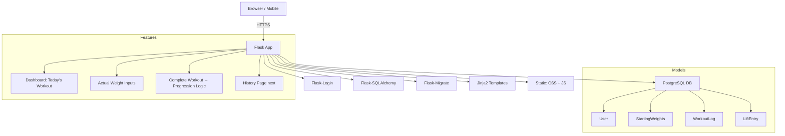

# WFM Lifts — Starting Strength Progression Tracker

**"No fake gains. Only truth."**

A mobile-first, brutally honest Starting Strength progression app. You log what you actually lift — not what you wish you lifted. Progression is earned, not automatic.

## Summary

WFM Lifts is a Flask web app that enforces the true rules of Starting Strength:
- Follow the Starting Strength lifting protocol
- Full warmup ladders with perfect plate math
- Real-time working weight editing
- Actual weight per work set logged
- Only successful workouts earn +5 lb
- Failed or deloaded lifts → next session uses what you actually did
- Full history of every rep, every failure, every triumph

Built for lifters who respect the program.

## Starting Strength Workout Logic (A / B / C)
Workout is in Phases 1, 2 and 3 (phases are set in the app)
Each phase has a cycle - A, B or C (C is phase 3 only)
The first workout is always A and then alternates

### Phase 1 & 2 (A/B only)
| Workout | Lifts                          |
|---------|--------------------------------|
| A       | Squat, Press, Deadlift         |
| B       | Squat, Bench Press, Power Clean (Phase 2) / Deadlift (Phase 1) |

### Phase 3 (A/B/C cycle)
| Workout | Lifts                          |
|---------|--------------------------------|
| A       | Squat, Press, Deadlift         |
| B       | Squat, Bench Press, Power Clean|
| C       | Squat, Bench Press, Power Clean|

### Progression Rules
- Work sets: 3×5 (except Deadlift/Power Clean = 1×5)
- Success = all prescribed work sets completed at actual weight
- Success → next workout uses `actual_weight + 5 lb`
- Failure (any missed reps/sets) → next workout uses the **last actual_weight** you lifted
- No automatic +5 lb on failure — honesty enforced

### Example Progression
| Day | Squat (planned) | You Lifted | Success? | Next Day |
|-----|------------------|------------|----------|----------|
| A   | 225              | 225×5×3    | Yes      | 230      |
| B   | 230              | 225×5×2    | No       | 225      |
| A   | 225              | 225×5×3    | Yes      | 230      |

**This is the truth. This is Starting Strength.**

## Warmup Progression Logic (Starting Strength Standard)
The working weights are set in the app on the dashboard and can be overridden.
The actual weight lifted for the working set defaults to the working weight, but can be overridden. Once completed, the actual weight is incremented by 5lb only if the actual weight = the working weight. Otherwise, the working weight on the next day is the actual weight without the 5lb increment.

### For any working weight ≥ 95 lb
| Set | % of Working Weight | Reps | Purpose                     |
|-----|---------------------|------|-----------------------------|
| 1   | Empty bar (45 lb)   | 5×2  | Warm joints, groove pattern |
| 2   | ~50%                | 5×1  | Light technical work        |
| 3   | ~70%                | 3×1  | Ramp up nervous system      |
| 4   | ~85–90%             | 2×1  | Final prep                  |
| 5+  | 100% (Working)      | 5×3  | Work sets (or 1×5 DL/PC)    |

### Exact Math (rounded to nearest 5 lb)
```python
jump = round((working_weight - 45) / 4 / 5) * 5
Set 1: 45 lb
Set 2: 45 + jump
Set 3: 45 + 2×jump
Set 4: 45 + 3×jump
Set 5+: working_weight
```

### Examples
| Working | Set 1 | Set 2 | Set 3 | Set 4 | Work Sets |
|---------|-------|-------|-------|-------|-----------|
| 135 lb  | 45    | 75    | 105   | 135   | 135×5×3   |
| 225 lb  | 45    | 95    | 145   | 195   | 225×5×3   |
| 315 lb  | 45    | 135   | 225   | 315   | 315×5×3   |
| 405 lb  | 45    | 185   | 315   | 405   | 405×5×1   |

### Special Cases
- Working weight ≤ 45 lb → only empty bar warmups + work sets
- Deadlift / Power Clean → only **1 work set**
- All warmups use perfect plate math (45s, 25s, 10s, 5s, 2.5s)

**This is the sacred warmup ladder. It never changes.**


## High-Level Architecture (Mermaid)



## Tech Stack & Versions (as of Dec 2025)

| Component           | Version / Choice            |
|---------------------|-----------------------------|
| Python              | 3.11+                       |
| Flask               | 3.0+                        |
| Flask-Login         | latest                      |
| Flask-SQLAlchemy    | latest                      |
| Flask-Migrate       | latest                      |
| Flask-WTF           | latest                      |
| PostgreSQL          | 16+ (local + Render)        |
| psycopg2-binary     | latest                      |
| Jinja2              | latest                      |
| Werkzeug            | latest                      |
| Frontend            | Vanilla JS + CSS            |
| Hosting (future)    | Render.com (free tier)      |

## Folder Structure
```
WFM-Lifts/
├── app/
│   ├── __init__.py
│   ├── models.py
│   ├── routes.py
│   ├── forms.py
│   ├── utils.py
│   ├── templates/
│   └── static/
│       ├── css/style.css
│       └── js/main.js
├── migrations/
├── instance/
├── venv/
├── run.py
├── config.py
├── PROJECT.md          ← This file
└── requirements.txt
```

## Key Decisions & Why

| Decision                      | Reason                                                                 |
|-------------------------------|------------------------------------------------------------------------|
| PostgreSQL over SQLite        | No file permission hell. Identical to production (Render)              |
| Actual weight per work set    | Honesty. Progression based on reality                                  |
| No automatic +5 lb            | Only earned. Failed sets = same weight next time                       |
| Vanilla JS + CSS              | Fast, mobile-first, no build step                                      |
| Mobile-first design           | Used at the gym — must be perfect on phone                             |
| Render.com deployment         | Free, zero config, GitHub auto-deploy                                  |
| All CSS & JS is kept          | For cleanliness                                                        |
| separate files                |                                                                        |

## Roadmap

| Milestone                     | Status   | Notes                              |
|-------------------------------|----------|------------------------------------|
| Full warmup + plates          | Done     | Perfect Starting Strength ladders  |
| Login/Register                | Done     | Secure, hashed                     |
| Actual weight logging         | Done     | Per work set                       |
| True progression              | Done     | Only success earns +5 lb           |
| History Page                  | Done     | Every rep, every failure           |
| Rest Day logging              | Done     |                                    |
| Settings page                 | Done     | Phase, plates                      |
| PWA / Add to Home Screen      | Done     |                                    |
| Settings page                 | Later    | Deload, K vs Lbs, Completion Sound |
| Export data (CSV)             | Later    |                                    |
| Deploy to Render.com          | Final    | Public URL                         |

## Open Questions

- Per-set rep counting (5,5,3) or just completed/failed?
- Auto deload recommendation on 3 failures?
- Bodyweight tracking?
- Dark/light mode toggle?
- Victory sound on workout complete? (Hell yes)

---

**This file is the single source of truth.**  
We update it as we build.

**WFM Lifts is no longer an app.**  
**It’s a movement.**

**LET’S FUCKING GO.**